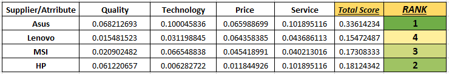

# Supplier Selection by Ranking Method

#

♦ Formulated a problem of supplier selection process for a single product and multi suppliers.

♦ Criteria considered for assessment of the suppliers were Quality, Technology, Price, Service.

♦ Ranking the list of Laptop Suppliers using rating method, Pair-Wise comparison using Borda Count &  Analytic Hierarchy Process (AHP).

♦ Outcome: Comparing the rankings obtained, Best Supplier was selected.

## Final Result 

